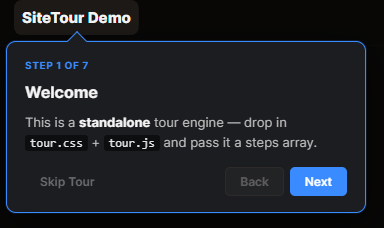
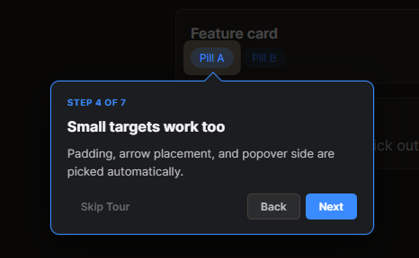
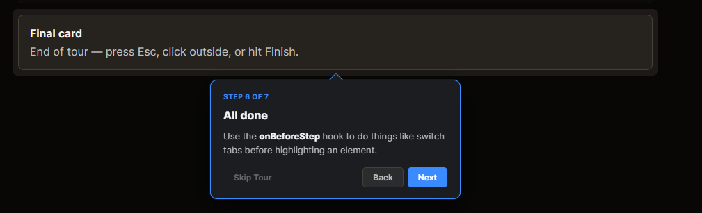
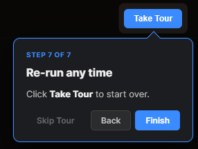

# SiteTour

A lightweight, dependency-free, Boarding.js-inspired walkthrough engine. Dims
the page with an SVG cutout around a target element and shows a popover with
**Next / Back / Skip**. Themed for dark UI by default, retheme via CSS variables.

~250 lines of JS, no build step, no framework.

## Quick start

```html
<link rel="stylesheet" href="tour.css">
<script src="tour.js"></script>
<script>
  const tour = new SiteTour({
    steps: [
      { selector: ".brand",    title: "Welcome",    body: "Hi there." },
      { selector: "#settings", title: "Settings",   body: "Configure here." },
    ],
  });
  document.getElementById("startBtn").addEventListener("click", () => tour.start());
</script>
```

See [`index.html`](index.html) for a runnable demo.

## Screenshots



*Opening step: a centered intro card explaining what the engine is and how to drop it in.*



*Small targets work too — padding, arrow placement, and popover side are picked automatically.*



*Anchoring under a wide element: the popover sits below the cutout with the arrow pointing up at the highlighted card.*



*Last step uses Finish instead of Next and points back at the trigger so users know how to re-run the tour.*

## API

### `new SiteTour(options)`

| option         | type       | description                                                                 |
| -------------- | ---------- | --------------------------------------------------------------------------- |
| `steps`        | `Step[]`   | Ordered list of steps. Required.                                            |
| `filter`       | `fn(step)` | Return `false` to exclude a step (e.g. permission-gated).                   |
| `onBeforeStep` | `fn(step)` | Called before each step renders. Use to switch tabs, open menus, etc.       |
| `onStart`      | `fn()`     | Called when `start()` runs.                                                 |
| `onEnd`        | `fn()`     | Called when the tour finishes or is dismissed.                              |

### `Step`

```js
{
  selector: "#element-id",   // CSS selector for the target
  title: "Heading",
  body: "HTML allowed — <strong>bold</strong>, <code>code</code>, etc.",
  skipIfHidden: true,        // (default) auto-skip if target isn't visible
  // ...any extra keys are passed through to onBeforeStep/filter
}
```

### Methods

- `tour.start()` — start from step 0
- `tour.end()` — dismiss
- `tour.next()` / `tour.back()` — step navigation

### Keyboard

- `→` / `Enter` — next
- `←` — back
- `Esc` — dismiss

## Theming

Override the CSS variables at the top of `tour.css`:

```css
:root {
  --tour-accent: #ff6a00;
  --tour-bg: #ffffff;
  --tour-text: #111;
  /* ... */
}
```

## Patterns

### Switch tabs before highlighting

```js
new SiteTour({
  steps: [
    { selector: "#auditBtn", title: "Audit", body: "...", tab: "audit" },
  ],
  onBeforeStep: (step) => {
    if (step.tab) switchTab(step.tab);
  },
});
```

### Permission-gated steps

```js
new SiteTour({
  steps: [
    { selector: "#staff", title: "Staff", body: "...", requiresPerm: "canManageStaff" },
  ],
  filter: (step) => !step.requiresPerm || currentUser.perms[step.requiresPerm],
});
```

### Inject mock content for empty states

Some steps may point at a target that's only populated after a user action
(e.g. a results panel). Use `onStart` / `onEnd` to swap in mock HTML for the
duration of the tour:

```js
let stash = [];
new SiteTour({
  steps: [...],
  onStart: () => {
    const el = document.getElementById("results");
    stash.push({ el, html: el.innerHTML });
    el.innerHTML = mockResultsHtml();
  },
  onEnd: () => {
    stash.forEach(({ el, html }) => { el.innerHTML = html; });
    stash = [];
  },
});
```

## License

MIT
